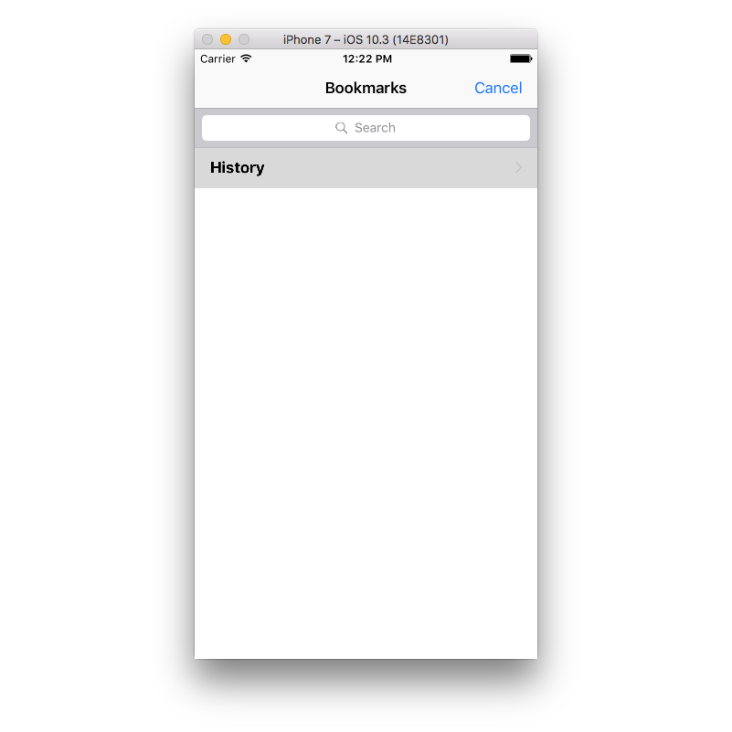

# eyeBrowser

This was a fun prototype iOS browser app. The goals of this project were:

- Learn swift. This project was written for swift 1 but since updated to be compatible with swift 3.
- Create my own private iOS browser.
- Create a browser that would interface with OpenDNS filters. This did not happen since OpenDNS does not a public api.

## Features

For a prototype, the browser has a lot of features.

### Independent browsing history and bookmarks.

### Page sharing.

### Tabbed browser pages.

